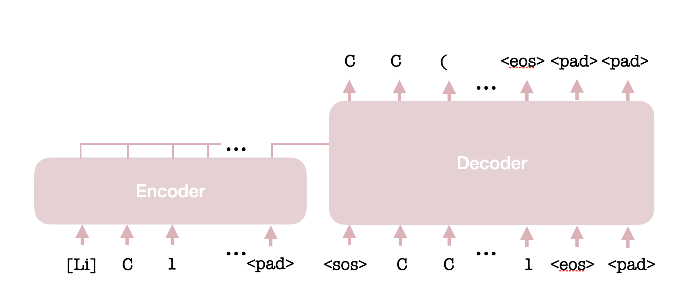

# rxn-lm: Reaction Language Models
Code to accompany our paper: _XXX_ (see also the repository [here](https://github.com/john-bradshaw/rxn-splits) for splitting code).
This repo contains a sequence-to-sequence [1,2,3] model for reaction prediction using [Hugging Face](https://huggingface.co/) [4].
**Note this repo makes use of [Git LFS](https://git-lfs.com/) for storing large files.**




## 1. Installation/Setup

We recommend installing the required Python packages using the environment files in the `env` directory. 
Note that we provide an environment for macOS, but this is only to aid with debugging/editing the code and is not suitable
for training/evaluating models. 

1. Install prerequisites if not already on your system: [Git LFS](https://git-lfs.com/) and 
    [Conda](https://conda.io/projects/conda/en/latest/index.html)/[Mambda](https://mamba.readthedocs.io/en/latest/)
    or their lighterweight equivalents, [Miniconda](https://docs.anaconda.com/miniconda/)/[Micromamba](https://mamba.readthedocs.io/en/latest/user_guide/micromamba.html).
2. Clone the repository:
    `git clone git@github.com:john-bradshaw/rxn-lm.git`
3. Installation via using the provided yaml file, e.g. for Conda inside the cloned directory:
    `conda env create -f envs/conda-linux-env.yml`
4. Activate environment:
    `conda activate rxn-lm`.
5. Set environment variables:
    `source setup.sh`  (this needs to run from this directory; you can set the environment variables in this file as you see fit).
6. Create a [wandb (W&B)](https://wandb.ai/site) key file at `wandb_key.txt` in repo root and add your [wandb key](https://docs.wandb.ai/quickstart). 

### Testing
To run our unit tests:  
```bash
pytest testing/
```


## 2. Data preparation

The data preparation scripts are in `scripts/data_prep`. Usually the process from going from a dataset in SMILES line format
(i.e., a file where each line is a SMILES string representing a reaction) to a dataset in JSONL format is as follows:
1. Clean up reactions (e.g., remove atom maps) using `01_clean_data.py`.
2. Create a vocabulary using `02_create_vocab.py`.
3. Convert the dataset to JSONL format using `03_convert_to_jsonl.py`.

Note that if using our [rxn-splits](https://github.com/john-bradshaw/rxn-splits) code to produce OOD splits, then the 
files will already be in JSONL format. While we cannot provide the datasets we used in our paper (as they are derived from
the proprietary [Pistachio dataset](https://www.nextmovesoftware.com/pistachio.html)), we provide 
an already processed dataset (derived from USPTO) in `data/processed/USPTO_mixed_augm` as an example.

## 3. Training/Hyperparameter optimization

The train and hyperparameter optimization scripts are in `scripts/training`. The scripts should be executed within this
directory.

### Training a single model
To train a single model, run the following command:  
    `python single_run.py --group_name <group_name> --run_name <run_name> --local_dir_name results --config_pth <config_name>
`

The config defines the data location and hyperaparameters for the model. For instance, to run on the provided 
USPTO dataset, you could use `configs/uspto_augm/uspto_stereo_mixed_deftune.json`. 

### Hyperparameter optimization
The hyperparameter optimization is done using [Ray Tune](https://docs.ray.io/en/latest/tune/index.html). 
To use this first start Ray in one shell:  
`ray start --head`

Then run the hyperparameter optimization script:  
`python hyp_opt_via_ray_tune.py --experiment_name <experiment name> --num_samples 100 --config_pth <config path> --search_space_config_pth <search space config> --address auto`

For instance to run on the provided USPTO dataset you could use `configs/uspto_augm/uspto_stereo_mixed_deftune.json` and
`search_spaces/default_search_space_uspto.json` for the `<config path>` and `<search space config>` respectively. You 
can modify the `address` passed to Ray as required.

Details of the hyperparameter optimization will be shown on Weights and Biases (W&B) (see below), 
and one can also use the `loadhyp_opt_via_ray_tune.py` to query the best hyperparameters found.


### Syncing logs
We use [Weights and Biases (W&B)](https://wandb.ai/site) for tracking experiments. If you edit our `setup.sh` file to run
this in offline mode, then you can sync the wandb logs later by running:  
``wandb sync --include-offline ./*/wandb/offline*``

W&B runs are reported using the run name, and are grouped together by experiment/group names. 

## 4. Evaluation

Once you have trained a model you can evaluate it using the scripts in `scripts/evaluating`.

To evalaute a model with a single set of weights (possibly derived via averaging), one can use the script:  
`python single_eval.py --config_pth <config path> --run_name <eval run name> --save_preds`,
where the `<config path>` is the path to the evaluation config. This allows you to run the same model over different
evaluation datasets.

To enable the evaluation of multiple sets of weights over the same test sets, we provide the script `parallel_eval.py`.
This is useful example in evaluating the time-based splits, where models trained on different time cutoffs need to be 
evaluated on the same held-out 1970s–present day test sets. This will create the configs used for each of the single evals 
automatically. The `parallel_eval.py` is used as follows (to run 3 evaluations in parallel):  
`python parallel_eval.py --num_runs 3 --config_pth <config path> --parallel_run_name <parallel run name> --torch_num_threads_per_run 20 --save_preds`


## 5. Other open sourced molecular language models for reaction prediction
If you're looking for a language-based chemical reaction prediction model, you might also be interested in the following
repositories:
* [Molecular Transformer](https://github.com/pschwllr/MolecularTransformer). Note that the model we use here is very 
    similar, also using an encoder-decoder style transformer language model.
* [Graph2SMILES](https://github.com/coleygroup/Graph2SMILES): a graph neural network encoder, SMILES decoder reaction 
    prediction model.
* [Chemformer](https://github.com/MolecularAI/Chemformer): a BART-style approach  (including pretraining on a denoising task,
which is not done here) for molecular tasks, including reaction prediction. 


## 6. References
[1] Lewis, M., Liu, Y., Goyal, N., Ghazvininejad, M., Mohamed, A., Levy, O., Stoyanov, V. and Zettlemoyer, L. (2019)
‘BART: Denoising Sequence-to-Sequence Pre-training for Natural Language Generation, Translation, and Comprehension’, 
arXiv [cs.CL]. Available at: http://arxiv.org/abs/1910.13461.  
[2] Vaswani, A., Shazeer, N., Parmar, N., Uszkoreit, J., Jones, L., Gomez, A.N., Kaiser, L. and Polosukhin, I. (2017)
‘Attention Is All You Need’, in I. Guyon, U.V. Luxburg, S. Bengio, H. Wallach, R. Fergus, S. Vishwanathan, 
and R. Garnett (eds) Advances in Neural Information Processing Systems 30. Curran Associates, Inc., pp. 5998–6008.    
[3] Schwaller, P., Laino, T., Gaudin, T., Bolgar, P., Hunter, C.A., Bekas, C. and Lee, A.A. (2019)  
‘Molecular Transformer: A Model for Uncertainty-Calibrated Chemical Reaction Prediction’, ACS Central Science, 5(9), pp. 1572–1583.     
[4] Wolf, T., Debut, L., Sanh, V., Chaumond, J., Delangue, C., Moi, A., Cistac, P., Rault, T., Louf, R., Funtowicz, M., 
Davison, J., Shleifer, S., von Platen, P., Ma, C., Jernite, Y., Plu, J., Xu, C., Le Scao, T., Gugger, S., Drame, M.,
Lhoest, Q. and Rush, A.M. (2019) ‘HuggingFace’s Transformers: State-of-the-art Natural Language Processing’, 
arXiv [cs.CL]. Available at: https://doi.org/10.48550/arXiv.1910.03771.

